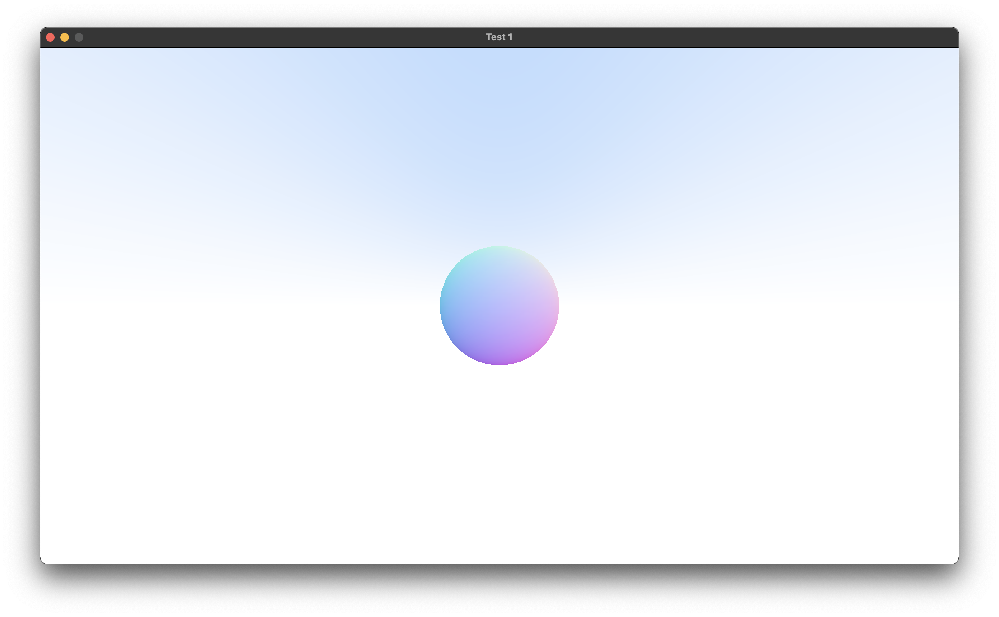

# Wololo Renderer

(Work in progress)

A cross-platform GPU-accelerated ray-tracing renderer using Vulkan.
Currently working through 
[Ray Tracing in One Weekend](https://raytracing.github.io/books/RayTracingInOneWeekend.html), but in GLSL.

The primary advantage of ray-tracing, even with few bounces, is its
support for procedural geometry that isn't in discrete (i.e. vertex)
form. Thus, this renderer will first try to support **Constructive**
**Solid Geometry**, with support for vertex-based meshes added later
(at which point **this repository will be renamed**).



# Build

- Download, then install the Vulkan SDK (platform-specific)
    -   Note: on macOS, ensure you configure the environment variables `VULKAN_SDK` and `DYLD_LIBRARY_PATH` 
        correctly..
        See `https://vulkan.lunarg.com/doc/view/1.1.108.0/mac/getting_started.html`

- Install CMake.
- Use CMake to configure and build:
    ```
    $ cmake .
    $ cmake --build . -j8
    ```

# Try It Out

- After building, run the following snippet in your shell of choice
  to execute the `wololo_demo` executable generated in the root directory
  of this repository.
    ```
    $ ./wololo_demo
    ```